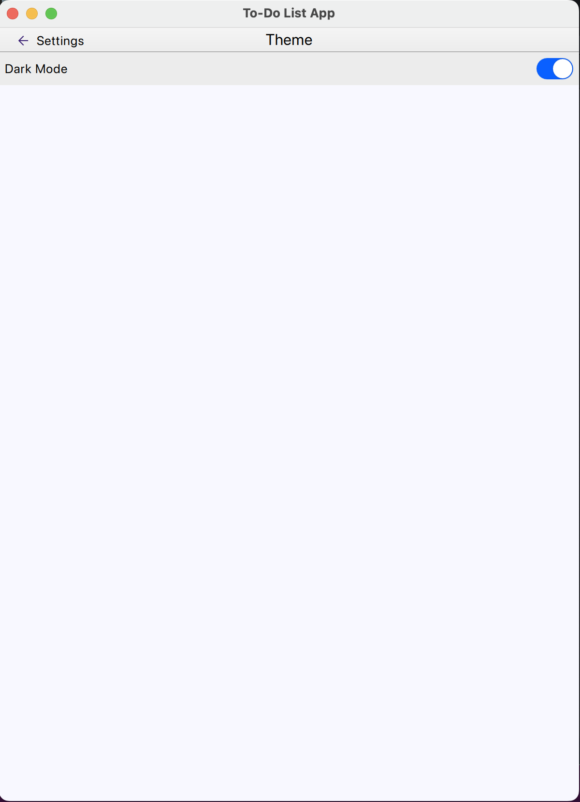

# ToDoListApp - Task Management Program

## Table of Contents:
- [Introduction](#introduction)
- [Project Features](#project-features)
- [Project Structure](#project-structure)
- [Project Management](#project-management)
- [Quick Overview](#quick-overview)
- [How to Run the Project](#how-to-run-the-project)
- [Team](#team)

### Introduction
This is a Qt C++ desktop application that allows user to manage tasks effectively. User can create, edit, delete tasks, and change the app parameter based on many options.

### Project Features
- Create tasks (Add new tasks with a title and description)
- Edit tasks (Modify the content of existing tasks)
- Delete tasks (Remove tasks from the list)
- Change Theme "Dark Mode"
- Change Font size
- Change the Maximum of number of tasks 
- Delete Done Tasks

### Project Structure

The project is built using:
Qt Version: 6.7.2
- Frontend:
  - QML
  - Qt Creator

### Project Management
1- Link to JIRA -> [jira](https://laurentjin.atlassian.net/jira/software/c/projects/TODO/boards/7)

2- Use Case Diagram  

### Quick Overview
1- Class Diagram  

2- Use Case Diagram  

3- Application MainPage   

4- Calendar Edit

5- Task Edit

6- Application Config Main Menu

7- Application Theme setting

8- Application Font setting

9- Application Max tasks setting

10- Application remove Done tasks setting

### How to Run the Project
#### Option 1: Run the Application
1. Clone the repository: git clone git@github.com:laurentdjin/ToDoListApp.git
2. Navigate to the Installer directory
3. Execute the installer to install the ToDoListApp on your system
4. installation steps
5. Launch the application
#### Option 2: Modify the Application
1. Download Qt & Qt Creator
2. Clone the repository.
3. Open Qt Creator, and then open the .pro project file located in the cloned repository.
4. Use Qt Creator to build the project.
5. Run the project.
    

### Team
This project was created by:

- [Laurent]
- [Bryan]
- [Noémie]
- [Mouhsine]

### Submitted to:
- Mr. Noah Saintonge 
  All rights reserved © 2024 - Datascientest
